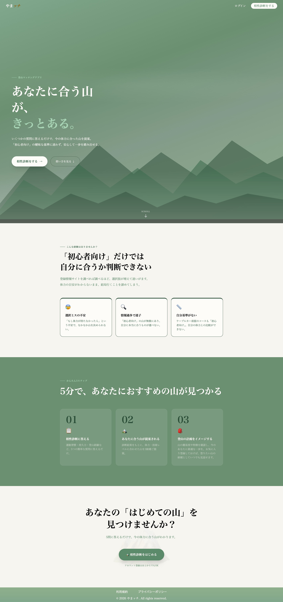
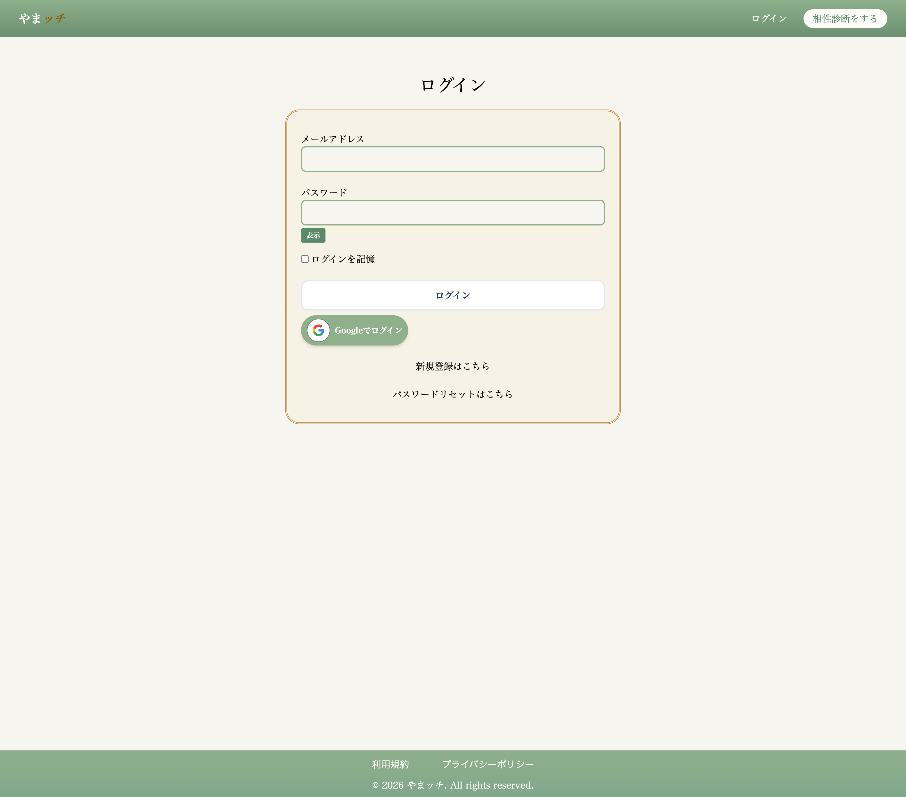
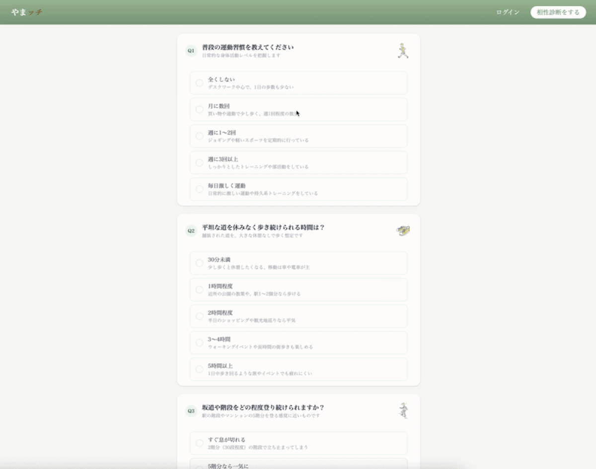
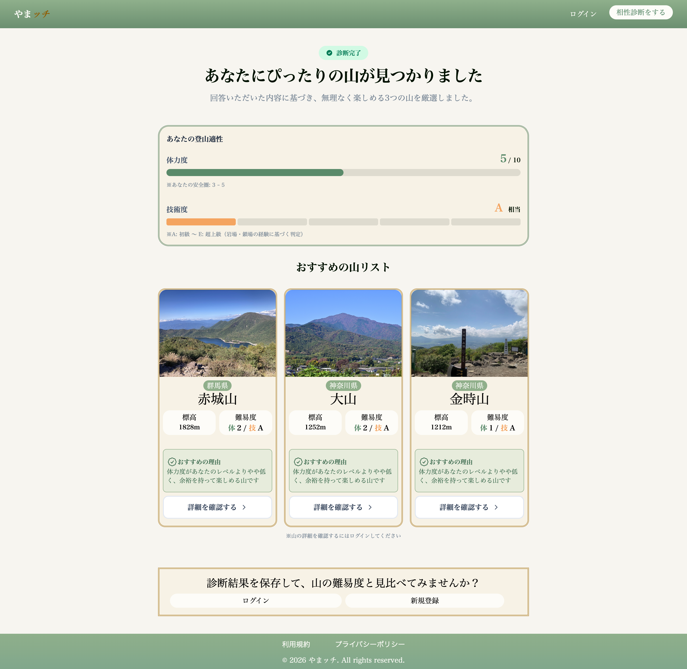
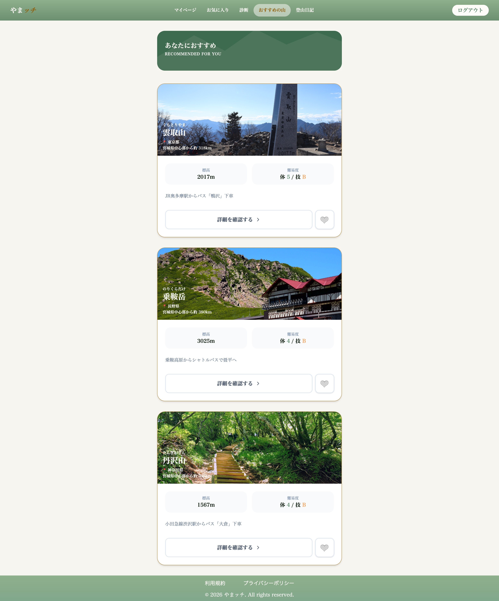
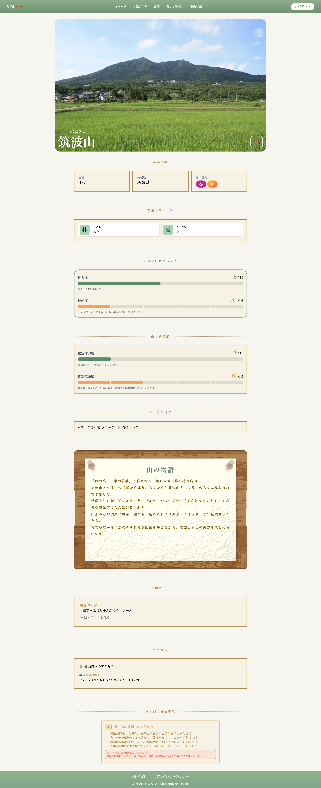
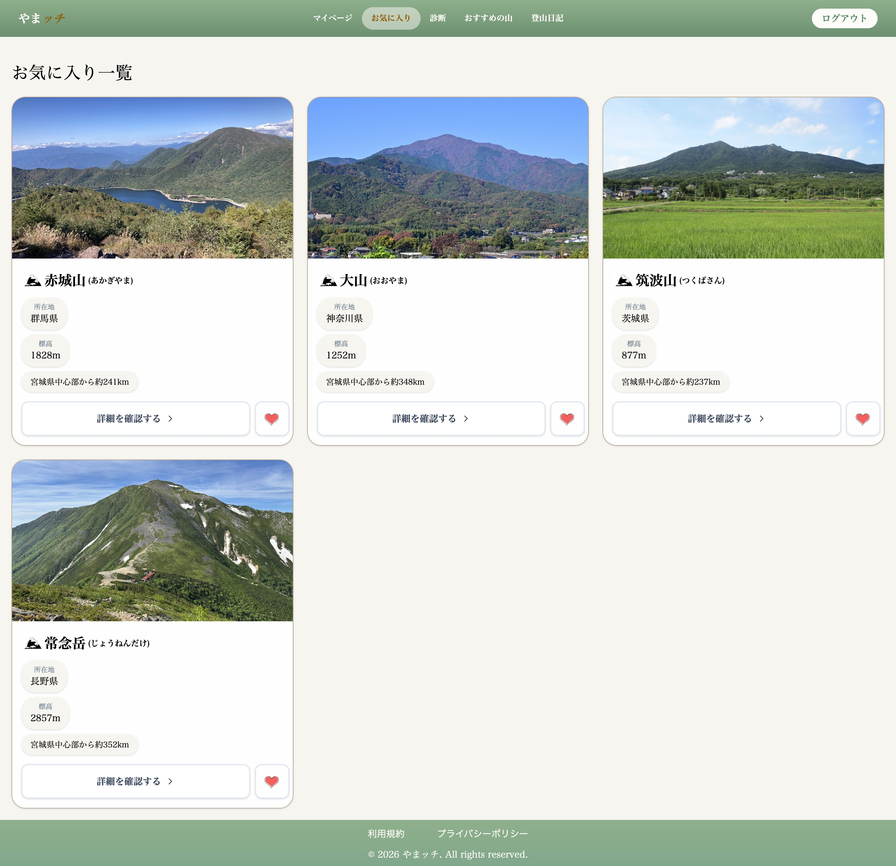
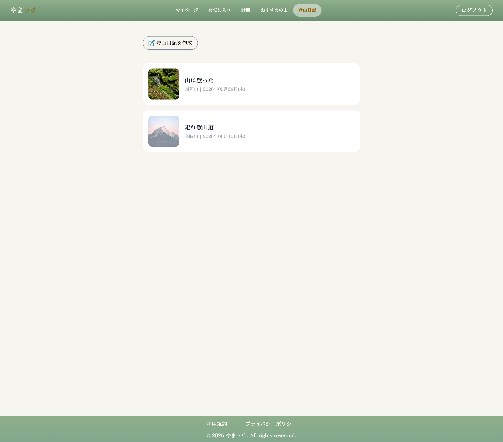
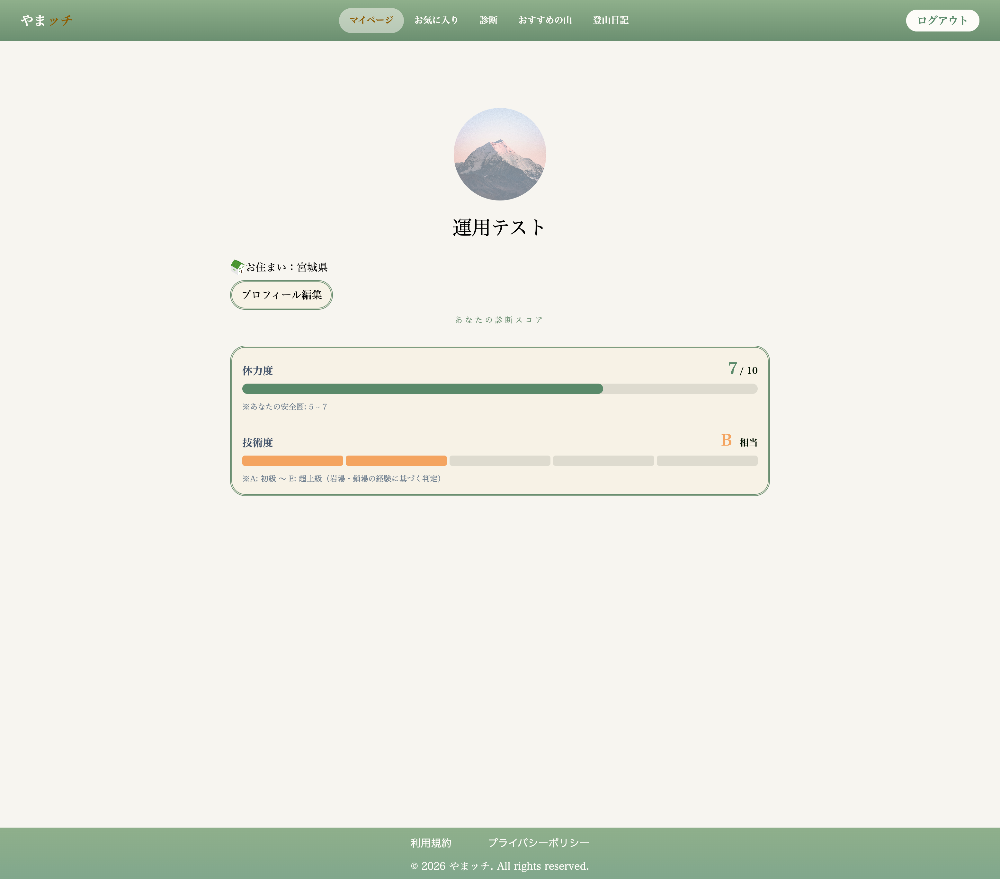
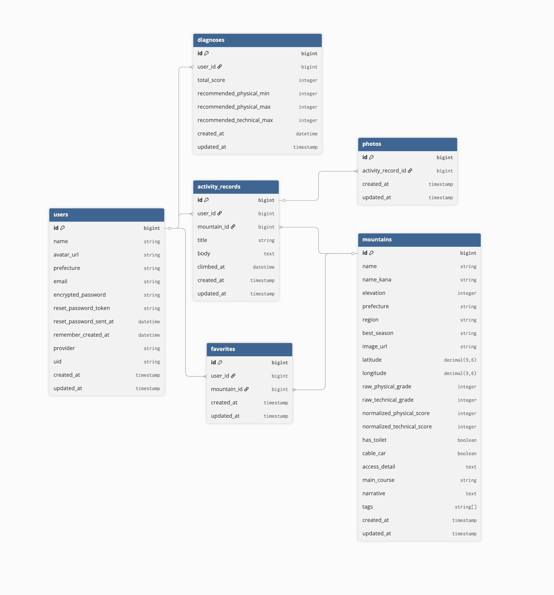

# やまッチ

> 自分の体力に合った山と出会える登山サポートアプリ

## 目次
- [サービス概要](#サービス概要)
- [開発背景](#開発背景)
- [デモ](#デモ)
- [主な機能](#主な機能)
- [技術スタック](#技術スタック)
- [ER図](#er図)
- [画面遷移図](#画面遷移図)

## サービス概要
やまッチは、登山してみたいけれど、自分に合う山がわからず一歩を踏み出せない人のためのWebアプリです。

いくつかの質問に答えるだけで、一人ひとりの体力や登山経験に合った山を提案します。また、山の詳細情報の閲覧や登山記録の管理を通して、安心して登山を始め、継続できる体験を提供します。

## 開発背景
以前は登山を楽しんでいましたが、しばらく間が空いた後に再開しようとした際、「初心者向け」と紹介されている山でも、自分の現在の体力に合っているのか判断できませんでした。

そのため、登山を諦めてしまうこともあれば、安心して登れると分かっている同じ山ばかりを選んでしまうこともありました。登山情報は多く公開されているものの、「自分に合う山」を判断する基準がなく、新しい山へ挑戦するきっかけを得られなかったことが課題でした。

この経験から、一人ひとりの体力や登山経験に合わせて山を提案し、安心して新しい山へ挑戦できるきっかけを提供したいと考え、「やまッチ」を開発しました。

## デモ

**URL**
- https://yamatchapp.com

**ゲストアカウント**

| 項目 | 内容 |
|------|------|
| Email | guest_test@example.com |
| Password | password123 |

## 主な機能
<table>
  <tr>
    <th>トップページ</th>
  </tr>
  <tr>
    <td align="center">
      
    </td>
  </tr>
  <tr>
    <td>
      サービスのコンセプトや特徴を紹介しています。
       初めて利用する方でも、アプリの目的や利用の流れを把握し、
      診断機能へスムーズに進めるトップページです。
    </td>
  </tr>
</table>

 

<table>
  <tr>
    <th>ログイン</th>
  </tr>
  <tr>
    <td align="center">
      
    </td>
  </tr>
  <tr>
    <td>
      メールアドレス・パスワードに加え、
       Googleアカウントを利用したログインにも対応しています。
      初めての方でも手軽に利用を開始できます。
    </td>
  </tr>
</table>

 

<table>
  <tr>
    <th>おすすめの山診断</th>
  </tr>
  <tr>
    <td align="center">
      
    </td>
  </tr>
  <tr>
    <td>
      体力や運動習慣、登山経験など5つの質問に回答することで、
      独自のスコアリングに基づき、一人ひとりに適した山を提案します。
    </td>
  </tr>
</table>

 

<table>
  <tr>
    <th>診断結果</th>
  </tr>
  <tr>
    <td align="center">
      
    </td>
  </tr>
  <tr>
    <td>
      回答内容から算出した診断スコアをもとに、
      自分のレベルに合ったおすすめの山を表示します。
       体力・技術レベルも確認できるため、山選びの目安として活用できます。
    </td>
  </tr>
</table>

 

<table>
  <tr>
    <th>おすすめの山一覧</th>
  </tr>
  <tr>
    <td align="center">
      
    </td>
  </tr>
  <tr>
    <td>
      診断結果をもとに、おすすめの山を一覧で表示します。
      難易度や地域、特徴を比較しながら、
      自分に合った山を選ぶことができます。
    </td>
  </tr>
</table>

 

<table>
  <tr>
    <th>山詳細</th>
  </tr>
  <tr>
    <td align="center">
      
    </td>
  </tr>
  <tr>
    <td>
      標高や難易度、設備情報、アクセス方法に加え、
      山の魅力や特徴も確認できます。
       登山前に必要な情報をまとめて確認できるページです。
    </td>
  </tr>
</table>

 

<table>
  <tr>
    <th>お気に入り</th>
  </tr>
  <tr>
    <td align="center">
      
    </td>
  </tr>
  <tr>
    <td>
      気になった山をお気に入りに登録できます。
      後から一覧で見返せるため、
      次回の登山計画にも活用できます。
    </td>
  </tr>
</table>

 

<table>
  <tr>
    <th>登山記録</th>
  </tr>
  <tr>
    <td align="center">
      
    </td>
  </tr>
  <tr>
    <td>
      登山日や写真、感想を記録し、
      自分だけの登山アルバムとして管理できます。
       過去の登山を振り返りながら、成長の記録を残せます。
    </td>
  </tr>
</table>

 

<table>
  <tr>
    <th>マイページ</th>
  </tr>
  <tr>
    <td align="center">
      
    </td>
  </tr>
  <tr>
    <td>
      プロフィールや居住地の編集に加え、
      診断スコアを確認できます。
      自分の基本情報や診断結果を管理するページです。
    </td>
  </tr>
</table>

## 技術スタック
| カテゴリ | 使用技術 |
|----------|----------|
| バックエンド | Ruby 3.3.6 / Ruby on Rails 8.0 |
| フロントエンド | Hotwire（Turbo・Stimulus）, Tailwind CSS |
| データベース | PostgreSQL |
| 認証 | Devise, OmniAuth Google OAuth2 |
| 画像管理 | Active Storage, Cloudinary |
| メール送信 | Resend |
| テスト | RSpec, FactoryBot, Faker |
| CI/CD | GitHub Actions |
| 静的解析・品質管理 | RuboCop, Brakeman |
| 開発環境 | Docker |
| デプロイ | Render |

## ER図
https://dbdiagram.io/d/69aa30c8a3f0aa31e1feceb9

## 画面遷移図
https://www.figma.com/design/EgmtVvZhOb0NGEzBbFnz9c/%E7%94%BB%E9%9D%A2%E9%81%B7%E7%A7%BB%E5%9B%B3?node-id=0-1&t=Qjos8FBqg8NYfnPT-1
